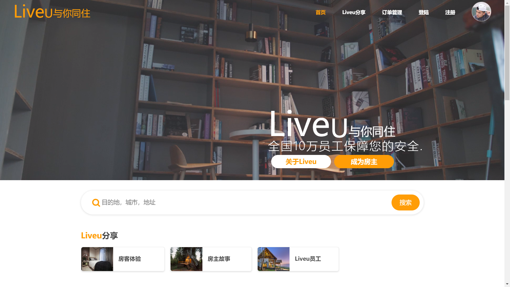
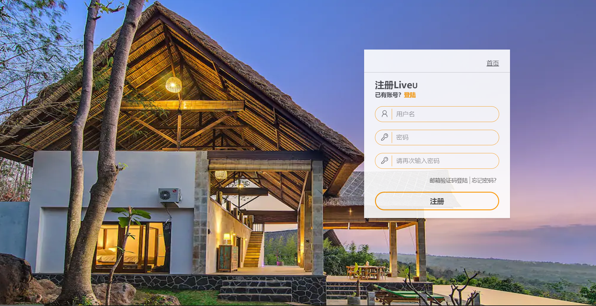
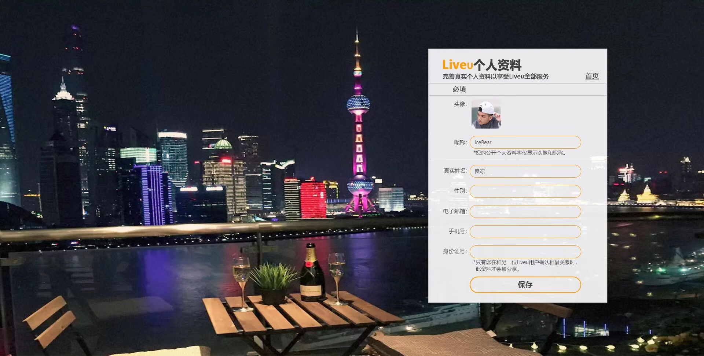
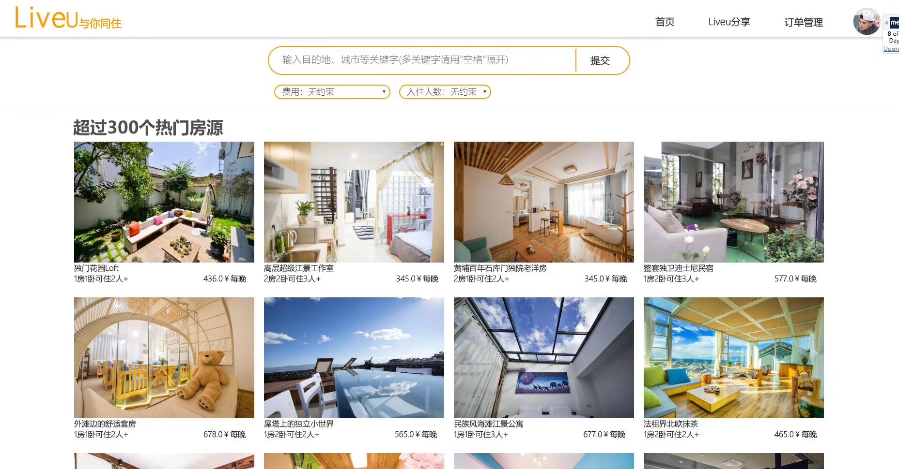
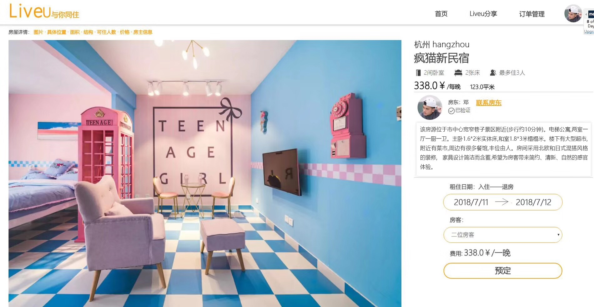
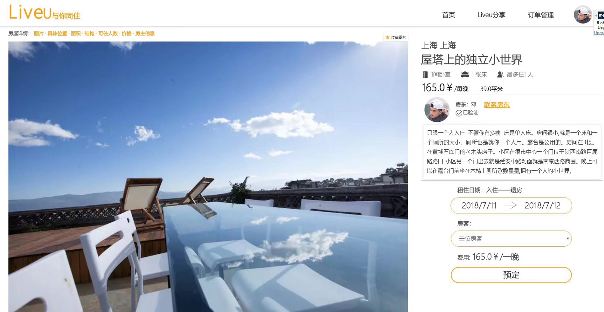
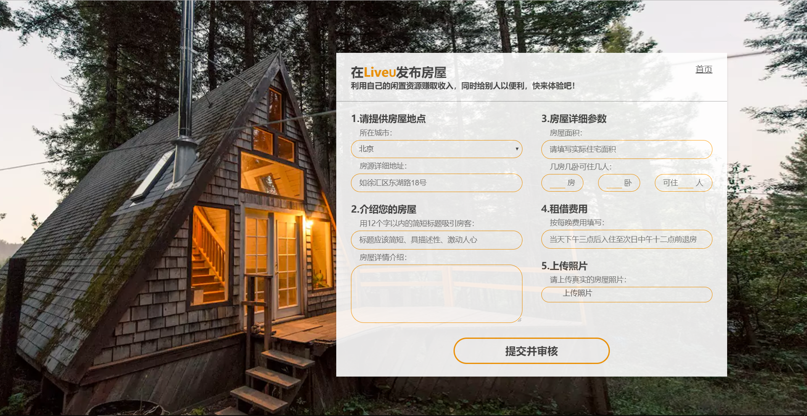
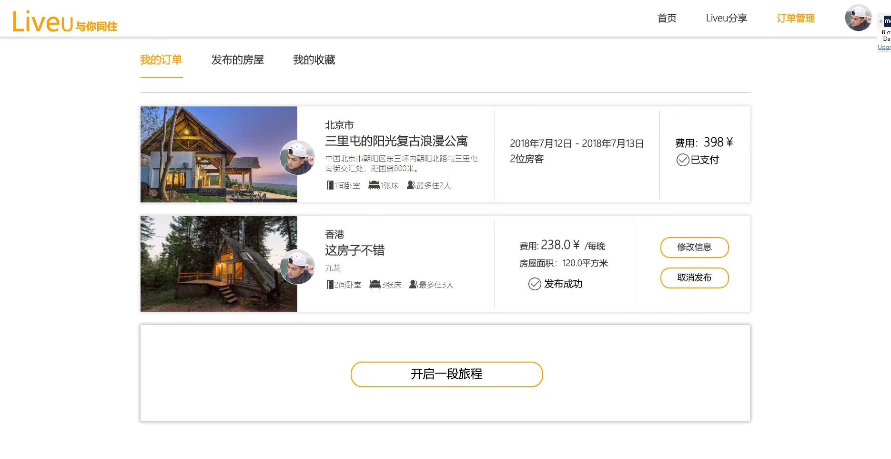
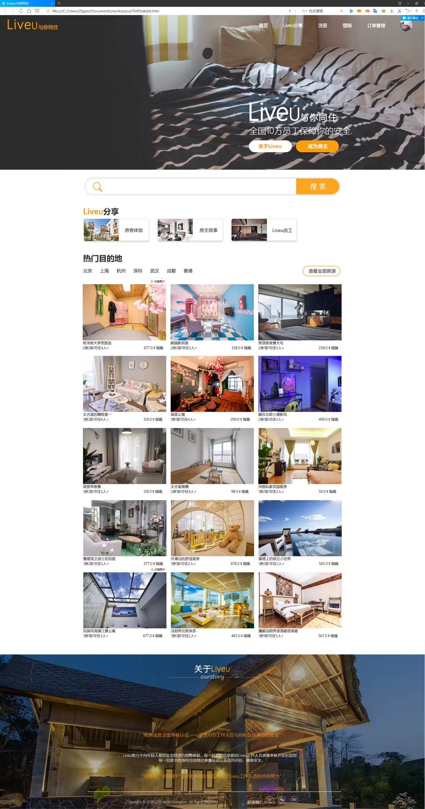

#  “Liveu”——与你同住住房网站web

##  关于“Liveu” 

 - **2018年6月软件工程专业实训项目**
 - **网站原型：参照了“爱彼迎”网站；**
 - **网页的UI进行系统设计，注重更好的交互体验；**

## 技术栈

 - **HTML5，CSS3，JavaScript**

## 关于作者

热爱前端的程序猿，喜欢设计，注重用户体验交互，注重细节。

---

## 页面展示

- **注册登陆**

- **个人信息页面**

- **搜索**

- **房屋详情页面🍔**

- **房屋发布页面**

- **个人订单管理✨**

- **网页全览**

---

## 个人总结
 - 第一次的web编码尝试，有太多不足，应加强代码可重构性，可阅读性，html的结构应该更加清晰，css的选择器使用恰当可减少不必要的class使用，js的代码重复，臃肿，亢余，不可维护，都是需要继续加强的。需要多学习网页性能优化方面。
